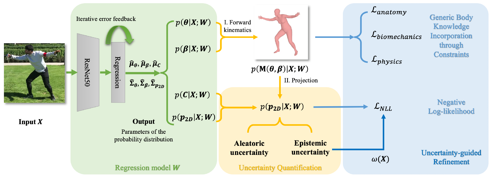
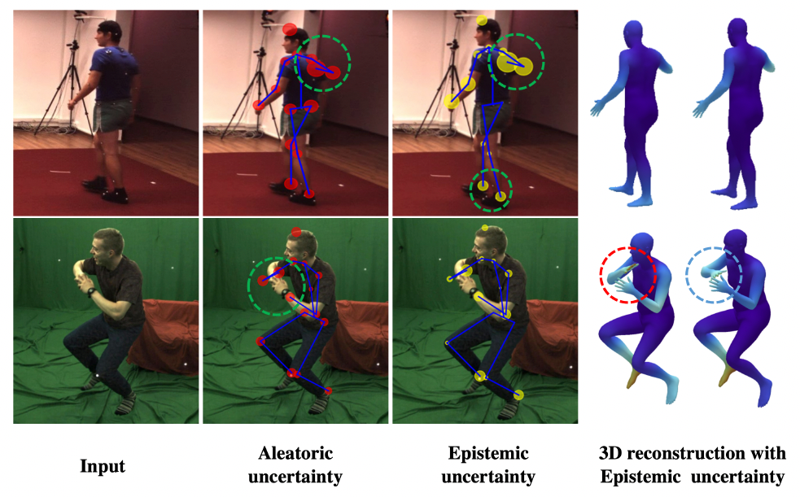

# <ins>KNOWN</ins>: Body <ins>Know</ins>ledge and U<ins>n</ins>certainty Modeling for Monocular 3D Human Body Reconstruction
  **Body Knowledge and Uncertainty Modeling for Monocular 3D Human Body Reconstruction** <br />
  [Yufei Zhang](https://zhangy76.github.io/), Hanjing Wang, Jeffrey O. Kephart, Qiang Ji <br /> 
  ICCV2023, [arXiv](https://arxiv.org/abs/2308.00799) <br />


This repository includes the Pytorch demo code and trained models for the above paper. 

## Installation
```bash
conda create -n known python=3.8
conda activate known
pip install -r requirements.txt
```

## Model and Data Download
Please download the trained model and required data from [data](https://www.dropbox.com/scl/fo/12m5bz2vi0sa6exap3cmu/h?rlkey=v79f2jdfc9qgfjeywe7i7bztn&dl=0) (due to license restrictions, please download "processed_basicModel_neutral_lbs_10_207_0_v1.0.0.pkl" from the [SMPL](https://github.com/vchoutas/smplx) website) and store them under the current directory as 
```
./data
├── cam_spin.npy
├── pose_spin.npy
├── shape_spin.npy
├── sigma_all.npy
├── model.pt
├── processed_basicModel_neutral_lbs_10_207_0_v1.0.0.pkl
```

## Demo
KNOWN is the first 3D human body reconstruction model that can quantify both epistemic and aleatoric uncertainty (running in near real-time). We here provide the demo code to generate 3D reconstruction and visualize the 3D vertex prediction uncertainty (epistemic uncertainty).
```bash
python demo_img.py --img_path 'path to a testing image'
python demo_live_video.py --video_path 'empty to open a live camera or path to a testing video'
```

Examples of KNOWN's output are <br />


## Citation
If you find our work useful, please consider citing the paper:
```bibtex
@InProceedings{Zhang_2023_ICCV,
    author    = {Zhang, Yufei and Wang, Hanjing and Kephart, Jeffrey O. and Ji, Qiang},
    title     = {Body Knowledge and Uncertainty Modeling for Monocular 3D Human Body Reconstruction},
    booktitle = {Proceedings of the IEEE/CVF International Conference on Computer Vision (ICCV)},
    month     = {October},
    year      = {2023},
    pages     = {9020-9032}
}
```

If you have questions or encouter any issues when running the code, feel free to open an issue or directly contact me via: zhangy76@rpi.edu.

## References
Part of our code is developed based on [SPIN](https://github.com/nkolot/SPIN). The SMPL model data is downloaded from [SMPL-X model](https://github.com/vchoutas/smplx). We thank them for generously sharing their outstanding work.
